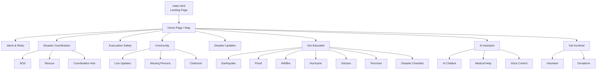

# 🛡️ SafeHaven

**SafeHaven** is a crowdsourced disaster management platform designed to help individuals and communities stay informed, prepared, and connected during emergencies.  
The platform focuses on awareness, coordination, safety guidance, and community-driven support during disasters.

---

## 🌍 About the Project

SafeHaven aims to act as a **central hub during disasters**, providing:
- Timely information and alerts
- Evacuation and safety guidance
- Community communication and coordination
- Educational resources for disaster preparedness
- Volunteer and donation engagement

The project is built as a **social good initiative** and maintained as an **open-source platform** to encourage collaboration and real-world impact.

---

## 🚀 Features

- **Real-time Alerts & Risk Awareness**
- **Disaster Coordination Hub** for rescue and response
- **Evacuation & Safety Guidelines**
- **Community Support & Updates**
- **Educational Resources** for disaster preparedness
- **AI-powered Assistant** for emergency and medical queries
- **Volunteer & Donation Engagement**

---

## 🧰 Tech Stack

- **HTML**
- **CSS**
- **JavaScript**

<!-- *(Currently a frontend-focused project; backend and integrations will be extended in the future.)* -->

---

## 📦 Installation

```bash
# Clone the repository
git clone https://github.com/archangel2006/SafeHaven.git

cd SafeHaven
cd public

# Run index.html Locally
```

---

## 📂 Project Structure

```
.public/
   ├── index.html
   │
   ├── 1. HomePage/
   │   ├── index.html
   │   └── Map.html
   │
   ├── 2. Alerts_Risks/
   │   └── AlertsRisks.html
   │
   ├── 3. DisasterCoordination/
   │   ├── coordination.html
   │   ├── hub.html
   │   ├── DisasterCoordination.html
   │   ├── rescue.html
   │   └── sos.html
   │
   ├── 4. Evacuation_Safety/
   │   └── EvacuationSafety.html
   │
   ├── 5. Community/
   │   ├── Community.html
   │   ├── LiveUpdates.html
   │   ├── MissingPerson.html
   │   └── chatroom.html
   │
   ├── 6. DisasterUpdates/
   │   └── DisasterUpdates.html
   │
   ├── 7. GetEducated/
   │   ├── GetEducated.html
   │   ├── earthquake.html
   │   ├── flood.html
   │   ├── hurricane.html
   │   ├── terrorism.html
   │   ├── volcano.html
   │   └── wildfire.html
   │
   ├── 8. AIAssistant/
   │   ├── AIAssistant.html
   │   ├── AIChatbot.html
   │   ├── MedicalHelp.html
   │   ├── SelectLanguage.html
   │   └── VoiceControl.html
   │
   ├── 9. GetInvolved/
   │   ├── Donate.html
   │   ├── Forms.html
   │   ├── MaterialDonations.html
   │   ├── MonetaryDonations.html
   │   └── Volunteer.html
   │
   └── .gitattributes
```
---
## 🏗️ Workflow Architecture

The following diagram represents the navigation workflow of the SafeHaven platform.  
It shows how users move from the Home Page to different modules and services.


---

## 🤝 Contributing

Please read the [CONTRIBUTING.md](./CONTRIBUTING.md) before submitting issues or pull requests.

**Use colors:** <br>


## Contributors

<p style="font-size:16px; font-weight:600;">Thanks to all contributors and community members for supporting and improving SafeHaven. 🙌</p><br>

<a href="https://github.com/archangel2006/SafeHaven/graphs/contributors">
  
</a>

## 📜 Code of Conduct

This project follows a community-driven Code of Conduct to ensure a respectful and inclusive environment.  
Read more in [CODE_OF_CONDUCT.md](./CODE_OF_CONDUCT.md).

## 📄 License

This project is licensed under the MIT License.  
See [LICENSE.md](./LICENSE.md) for details. 
